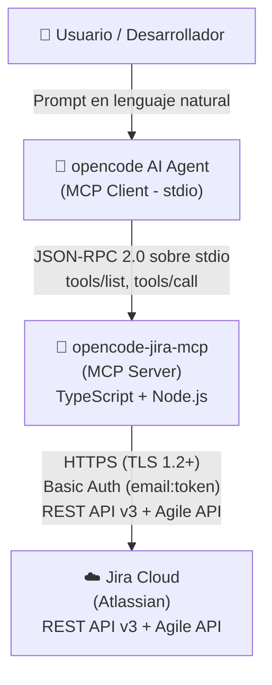
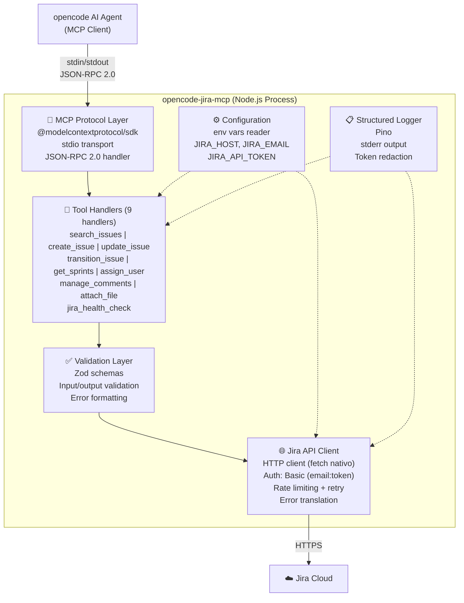

# Arquitectura del Sistema — opencode-jira-mcp

> **Ultima actualizacion:** 2026-06-13
> **Version:** 1.0.0 (MVP)
> **Proyecto:** opencode-jira-mcp
> **Tipo:** MCP (Model Context Protocol) Server
> **Stack:** TypeScript + Node.js + @modelcontextprotocol/sdk

---

## 1. Proposito y alcance

### 1.1 Proposito

**opencode-jira-mcp** es un MCP Server que expone la API de Jira Cloud como herramientas (tools) consumibles desde opencode (AI coding agent). Permite buscar, crear, actualizar, transicionar y gestionar issues de Jira sin salir del contexto de desarrollo, mediante interaccion en lenguaje natural que el agente traduce a llamadas estructuradas JSON-RPC 2.0 sobre stdio.

### 1.2 Alcance funcional (MVP v1.0.0)

| # | Tool MCP | Descripcion | Prioridad |
|---|----------|-------------|-----------|
| T1 | `search_issues` | Busqueda avanzada con JQL, filtros, paginacion | P0 |
| T2 | `create_issue` | Crear tareas, bugs, historias, epicas | P0 |
| T3 | `update_issue` | Modificar campos editables de un issue | P0 |
| T4 | `transition_issue` | Mover issues entre estados del workflow | P0 |
| T5 | `get_sprints` | Listar sprints activos/futuros y sus issues | P1 |
| T6 | `assign_user` | Asignar o quitar responsable de un issue | P1 |
| T7 | `manage_comments` | Leer y escribir comentarios en issues | P1 |
| T8 | `attach_file` | Subir archivos adjuntos a issues | P2 |
| T9 | `jira_health_check` | Validar conectividad y credenciales | P0 |

### 1.3 Exclusiones explicitas (Out of Scope)

- Autenticacion OAuth 2.0 (3LO) — post-MVP
- Webhooks / eventos en tiempo real
- Soporte para Jira Server / Data Center
- Gestion de proyectos (CRUD de proyectos)
- Gestion de usuarios (CRUD de usuarios)
- Tableros Kanban/Scrum (CRUD de tableros)
- Workflows personalizados (CRUD de workflows)
- Reportes avanzados / dashboards
- Caché local de datos de Jira

---

## 2. Diagrama de contexto (C4 — Nivel 1)



**Actores y sistemas externos:**

| Sistema | Tipo | Descripcion |
|---------|------|-------------|
| **Usuario / Desarrollador** | Persona | Interactua con opencode en lenguaje natural. Configura el token Jira. |
| **opencode (AI Agent)** | MCP Client | Consume el MCP Server via stdio. Invoca tools y procesa respuestas. |
| **Jira Cloud** | Sistema externo | API destino. Instancia Atlassian accesible via HTTPS. |

---

## 3. Diagrama de contenedores (C4 — Nivel 2)



**Capas internas del MCP Server:**

| Capa | Responsabilidad | Dependencias |
|------|----------------|--------------|
| **MCP Protocol Layer** | Manejo del ciclo de vida MCP: `initialize`, `tools/list`, `tools/call`. Serializacion/deserializacion JSON-RPC 2.0. Gestion del transporte stdio. | `@modelcontextprotocol/sdk` |
| **Tool Handlers** | Logica de negocio de cada tool. Orquestacion de llamadas a Jira. Transformacion de datos Jira → respuesta MCP. | Validation Layer, Jira Client |
| **Validation Layer** | Validacion estricta de entrada con Zod schemas. Formateo de errores de validacion para el agente. | `zod` |
| **Jira API Client** | Cliente HTTP reutilizable. Autenticacion Basic. Rate limiting con backoff exponencial. Traduccion de errores HTTP → mensajes accionables. Sanitizacion de headers en logs. | Node.js `fetch` nativo |
| **Configuration** | Lectura y validacion de variables de entorno. Sin estado mutante. | `process.env` |
| **Logger** | Logging estructurado a stderr. Redaccion automatica de tokens. Niveles: error, warn, info, debug. | `pino` |

---

## 4. Topologia de modulos TypeScript

```
opencode-jira-mcp/
├── src/
│   ├── index.ts                  # Entry point: inicializa MCP Server
│   ├── server.ts                 # Configuracion y arranque del MCP Server
│   ├── config/
│   │   └── env.ts                # Lectura tipada de variables de entorno
│   ├── tools/
│   │   ├── register.ts           # Registro de tools en el MCP Server
│   │   ├── search-issues.ts      # Tool handler: search_issues
│   │   ├── create-issue.ts       # Tool handler: create_issue
│   │   ├── update-issue.ts       # Tool handler: update_issue
│   │   ├── transition-issue.ts   # Tool handler: transition_issue
│   │   ├── get-sprints.ts        # Tool handler: get_sprints
│   │   ├── assign-user.ts        # Tool handler: assign_user
│   │   ├── manage-comments.ts    # Tool handler: manage_comments
│   │   ├── attach-file.ts        # Tool handler: attach_file
│   │   └── health-check.ts       # Tool handler: jira_health_check
│   ├── schemas/
│   │   ├── search-issues.ts      # Zod schemas (input + output)
│   │   ├── create-issue.ts
│   │   ├── update-issue.ts
│   │   ├── transition-issue.ts
│   │   ├── get-sprints.ts
│   │   ├── assign-user.ts
│   │   ├── manage-comments.ts
│   │   ├── attach-file.ts
│   │   └── health-check.ts
│   ├── client/
│   │   ├── jira-client.ts        # Cliente HTTP base (auth, headers, fetch)
│   │   ├── rate-limiter.ts       # Rate limiting con backoff exponencial
│   │   ├── error-mapper.ts       # Traduccion de errores Jira → mensajes
│   │   └── auth.ts               # Construccion header Basic Auth
│   ├── logging/
│   │   └── logger.ts             # Pino logger (stderr, redaction)
│   └── types/
│       ├── mcp.ts                # Tipos MCP (ToolDefinition, ToolCallResult)
│       └── jira.ts               # Tipos de dominio Jira (Issue, Sprint, etc.)
├── tests/
│   ├── unit/
│   │   ├── tools/                # Pruebas unitarias de cada tool handler
│   │   ├── client/               # Pruebas del cliente HTTP y rate limiter
│   │   └── config/               # Pruebas de lectura de config
│   ├── integration/
│   │   ├── mcp-protocol.test.ts  # Pruebas del ciclo MCP completo
│   │   └── jira-client.test.ts   # Pruebas contra Jira (requiere credenciales)
│   └── fixtures/
│       └── responses/            # Respuestas mock de Jira API
├── docs/
│   ├── analysis/
│   │   ├── scope.md
│   │   ├── use-cases.md
│   │   ├── interaction-model.md
│   │   └── authentication-flow.md
│   └── architecture.md           # Este documento
├── .env.example                  # Template de variables de entorno
├── .gitignore
├── .eslintrc.json
├── .prettierrc
├── tsconfig.json
├── package.json
└── README.md
```

### Convenciones de archivos

| Convencion | Regla |
|------------|-------|
| Un tool handler por archivo en `src/tools/` | 1:1 con las tools MCP registradas |
| Un schema file por tool en `src/schemas/` | Schemas Zod de entrada y salida |
| Un archivo de pruebas por clase/modulo | Nombrado `{modulo}.test.ts` |
| Tipos compartidos en `src/types/` | Interfaces, enums, type aliases |
| Cliente Jira autocontenido en `src/client/` | Sin dependencia circular con tools |

---

## 5. Stack tecnologico detallado

### 5.1 Runtime y lenguaje

| Componente | Tecnologia | Version | Justificacion |
|-----------|-----------|---------|---------------|
| **Runtime** | Node.js | >= 18 LTS (recomendado 22 LTS) | Requerido por `@modelcontextprotocol/sdk`. Soporte nativo de `fetch`, `ReadableStream`, ESM. |
| **Lenguaje** | TypeScript | ^5.5 | Tipado fuerte requerido para schemas Zod y contratos de tools. Compila a ESNext. |
| **Module system** | ESM (`"type": "module"`) | — | Alineado con el ecosistema MCP y paquetes modernos. Mejor tree-shaking. |

### 5.2 SDK y protocolo

| Componente | Tecnologia | Version | Justificacion |
|-----------|-----------|---------|---------------|
| **MCP SDK** | `@modelcontextprotocol/sdk` | ^1.0.0 | SDK oficial de Anthropic. Manejo de transporte stdio, registro de tools, serializacion JSON-RPC. |
| **Transporte** | stdio (`StdioServerTransport`) | — | Unico transporte del MVP. Sin dependencia de red interna. Compatible con opencode. |

### 5.3 Validacion

| Componente | Tecnologia | Version | Justificacion |
|-----------|-----------|---------|---------------|
| **Validacion** | `zod` | ^3.24 | Schemas estrictos con inferencia TypeScript. Generacion de JSON Schema para `tools/list`. |

### 5.4 Cliente HTTP

| Componente | Tecnologia | Version | Justificacion |
|-----------|-----------|---------|---------------|
| **HTTP Client** | `fetch` nativo (Node.js 18+) | — | Sin dependencia externa. Soporte nativo de streaming, AbortController. Menos superficie de ataque que axios/undici. Ver ADR-004. |

### 5.5 Logging

| Componente | Tecnologia | Version | Justificacion |
|-----------|-----------|---------|---------------|
| **Logger** | `pino` | ^9.0 | Logger JSON estructurado mas rapido de Node.js. Output nativo a stderr. Soporte de redaction via serializers. |

### 5.6 Testing

| Componente | Tecnologia | Version | Justificacion |
|-----------|-----------|---------|---------------|
| **Test runner** | `vitest` | ^2.0 | Rapido, compatible con ESM, soporte nativo TypeScript, watch mode. Mejor integracion VSCode que Jest. |
| **Mocking** | `vitest` (`vi.fn()`) | — | Incluido en vitest. Sin dependencia adicional. |
| **Assertions** | `vitest` (`expect`) | — | Incluido en vitest. |
| **Coverage** | `v8` (via vitest) | — | Incluido en vitest. |

### 5.7 Linting y formatting

| Componente | Tecnologia | Version | Justificacion |
|-----------|-----------|---------|---------------|
| **Linter** | `eslint` | ^9.0 | Estandar del ecosistema TypeScript. Configuracion flat config. |
| **TypeScript plugin** | `typescript-eslint` | ^8.0 | Reglas especificas para TypeScript. |
| **Formatter** | `prettier` | ^3.3 | Formateo consistente de codigo. Integrado con ESLint via `eslint-config-prettier`. |

### 5.8 Build y desarrollo

| Componente | Tecnologia | Version | Justificacion |
|-----------|-----------|---------|---------------|
| **TypeScript compiler** | `tsc` | Incluido en TypeScript | Compilacion estricta con `noUncheckedIndexedAccess`, `strictNullChecks`. |
| **Dev runner** | `tsx` | ^4.19 | Ejecucion directa de TypeScript en desarrollo sin compilacion previa. |
| **Package manager** | `npm` | Incluido en Node.js | Sin dependencias adicionales. `npm` es suficiente para el MVP. |

### 5.9 Distribucion

| Componente | Tecnologia | Version | Justificacion |
|-----------|-----------|---------|---------------|
| **Entry point** | `bin` en `package.json` | — | Ejecutable via `npx opencode-jira-mcp`. |
| **Publicacion** | npm registry | — | `npm publish` con `dist/` precompilado. |
| **Shebang** | `#!/usr/bin/env node` | — | Ejecutable directo en sistemas Unix. |

---

## 6. ADR — Architecture Decision Records

### ADR-001: Eleccion de TypeScript + Node.js + @modelcontextprotocol/sdk como stack base

**Estado**: Aceptado
**Fecha**: 2026-06-13

**Contexto**:
El proyecto requiere construir un MCP Server que exponga la API de Jira Cloud como tools para opencode. El SDK oficial de MCP (`@modelcontextprotocol/sdk`) esta escrito en TypeScript y disenado para Node.js. Se necesita un stack que maximice la compatibilidad con el ecosistema MCP, minimice la friccion de desarrollo y garantice tipado fuerte para las definiciones de tools.

**Alternativas consideradas**:
1. **Python + `mcp` (SDK oficial Python)** — Alternativa valida pero el ecosistema de opencode privilegia TypeScript/Node.js para tooling de desarrollo. Menor comunidad en el contexto de AI agents.
2. **Go + implementacion propia del protocolo** — Overkill para un MCP Server de 9 tools. El protocolo MCP es simple pero implementarlo desde cero introduce riesgo de incompatibilidad.
3. **.NET Core + implementacion propia** — El proyecto original usa .NET para microservicios, pero el MCP SDK no tiene implementacion oficial en .NET. Reimplementar el transporte stdio y JSON-RPC en .NET duplicaria el esfuerzo sin beneficio.

**Decision**:
Usar TypeScript + Node.js + `@modelcontextprotocol/sdk` como stack base.

**Consecuencias**:
- ✅ Maxima compatibilidad con el SDK oficial de MCP.
- ✅ Tipado fuerte con TypeScript, inferencia de schemas Zod.
- ✅ Ecosistema rico de herramientas: vitest, pino, tsx, eslint.
- ✅ Instalacion simple: `npx opencode-jira-mcp`.
- ❌ Node.js debe estar instalado (>= 18 LTS) — requisito documentado.
- ❌ No se aprovecha la infraestructura .NET existente en el harness.

---

### ADR-002: Eleccion de stdio como transporte MCP (vs HTTP/SSE)

**Estado**: Aceptado
**Fecha**: 2026-06-13

**Contexto**:
El protocolo MCP soporta dos transportes: **stdio** (standard input/output) y **HTTP/SSE** (Server-Sent Events). Se debe elegir el transporte para el MVP.

**Alternativas consideradas**:
1. **HTTP/SSE** — Requiere que el MCP Server exponga un endpoint HTTP. Introduce complejidad de red, puertos, CORS, y requiere que el proceso este corriendo como un servicio. Adecuado para escenarios multi-cliente o remotos, pero innecesario para un tooling local.
2. **stdio** — El cliente (opencode) spawnea el proceso Node.js y se comunica via stdin/stdout. Sin configuracion de red, sin puertos, sin CORS. El ciclo de vida del servidor esta acoplado al del cliente.

**Decision**:
Usar stdio como unico transporte MCP para el MVP.

**Consecuencias**:
- ✅ Sin configuracion de red. El MCP Server se spawnea como proceso hijo.
- ✅ stdout exclusivo para JSON-RPC, stderr para logs (segregacion natural).
- ✅ Ciclo de vida simple: el servidor muere cuando opencode se cierra.
- ✅ Compatible con `opencode.json` (configuracion declarativa de MCP servers).
- ❌ No soporta multiples clientes simultaneos (no necesario).
- ❌ No usable en escenarios remotos (post-MVP se evaluara HTTP/SSE).

---

### ADR-003: Eleccion de API Token de Atlassian como metodo de autenticacion (vs OAuth 2.0)

**Estado**: Aceptado
**Fecha**: 2026-06-13

**Contexto**:
Jira Cloud soporta API Token (Basic Auth) y OAuth 2.0 (3LO y 2LO). Se debe elegir el mecanismo de autenticacion para el MVP.

**Alternativas consideradas**:
1. **OAuth 2.0 (3LO)** — Requiere registrar una app en Atlassian Developer, configurar callback URL, implementar flujo de autorizacion con browser. Complejidad alta. Adecuado para apps multi-tenant, pero overkill para un CLI tool.
2. **OAuth 2.0 (2LO)** — Requiere app link en Jira. Complejidad media. Mejor que 3LO pero aun requiere configuracion administrativa en Jira.
3. **API Token (Basic Auth)** — El usuario genera un token en https://id.atlassian.com/manage/api-tokens. Solo necesita email + token. Complejidad minima.

**Decision**:
Usar API Token de Atlassian con Basic HTTP Authentication.

**Consecuencias**:
- ✅ Configuracion en < 2 minutos para el usuario.
- ✅ Sin dependencia de infraestructura (callback URL, app registration).
- ✅ Sin flujo de refresh tokens que gestionar.
- ✅ La arquitectura abstrae el auth provider (`JiraAuthProvider` interface) para facilitar OAuth en post-MVP.
- ❌ El token no expira automaticamente — el usuario debe rotarlo manualmente.
- ❌ El token tiene acceso total a la cuenta del usuario (sin scopes granulares).

---

### ADR-004: Estrategia de cliente HTTP (fetch nativo de Node.js 18+ vs axios vs undici)

**Estado**: Aceptado
**Fecha**: 2026-06-13

**Contexto**:
El MCP Server necesita un cliente HTTP para comunicarse con Jira Cloud REST API. Se evaluan tres opciones.

**Alternativas consideradas**:
1. **axios** — Libreria madura con interceptors, cancelacion, y API familiar. Pero es una dependencia externa con superficie de ataque (historico de CVEs). No aporta nada que `fetch` nativo no tenga para este caso de uso (requests simples con auth header).
2. **undici** — Cliente HTTP de bajo nivel para Node.js. Mas rapido que axios. Pero su API es mas compleja y cambia entre versiones. Overkill para requests REST simples.
3. **fetch nativo (Node.js 18+)** — API estandar disponible globalmente en Node.js >= 18. Sin dependencia externa. Soporta streaming, AbortController, y headers de forma nativa.

**Decision**:
Usar `fetch` nativo de Node.js como cliente HTTP para todas las llamadas a Jira Cloud.

**Consecuencias**:
- ✅ Cero dependencias externas para HTTP.
- ✅ API estandar compatible con browsers y runtimes modernos.
- ✅ Menor superficie de ataque (sin dependencia de terceros).
- ✅ AbortController nativo para timeouts.
- ❌ No tiene interceptors nativos — se implementa un wrapper delgado (`jira-client.ts`).
- ❌ Node.js < 18 no soporta `fetch` — pero el proyecto requiere Node.js >= 18 LTS.

---

### ADR-005: Estrategia de estructura del proyecto (modulos, capas)

**Estado**: Aceptado
**Fecha**: 2026-06-13

**Contexto**:
Se necesita una estructura de proyecto clara que separe responsabilidades: protocolo MCP, handlers de tools, schemas de validacion, cliente HTTP, configuracion y logging.

**Alternativas consideradas**:
1. **Monolito plano** — Todos los handlers en un solo archivo, schemas inline, cliente HTTP acoplado. Rapido de prototipar pero inmantenible a medida que crece el numero de tools.
2. **Clean Architecture (3 capas)** — Domain, Application, Infrastructure. Over-engineered para un MCP Server de 9 tools sin persistencia ni logica de dominio compleja.
3. **Modulos funcionales con capas horizontales** — Agrupacion por responsabilidad tecnica (tools/, schemas/, client/, config/, logging/, types/). Cada tool es un modulo autocontenido con su schema asociado.

**Decision**:
Estructura por modulos funcionales con capas horizontales. Un archivo por tool handler en `src/tools/`, un archivo de schema por tool en `src/schemas/`, y capas compartidas para cliente HTTP, configuracion y logging.

**Consecuencias**:
- ✅ Facil agregar nuevas tools: nuevo archivo en `tools/` + nuevo archivo en `schemas/`.
- ✅ Schemas reutilizables y testeables independientemente de los handlers.
- ✅ Cliente HTTP y rate limiter reutilizables por todos los handlers.
- ✅ Bajo acoplamiento: los handlers no se importan entre si.
- ❌ Mayor numero de archivos que un monolito plano (compensado por claridad).
- ❌ No hay capa de Domain pura — no es necesaria para un servidor stateless.

---

### ADR-006: Estrategia de manejo de errores y rate limiting

**Estado**: Aceptado
**Fecha**: 2026-06-13

**Contexto**:
Jira Cloud API tiene limites de rate y devuelve errores HTTP que deben traducirse a mensajes accionables para el LLM. El MCP Server debe manejar ambos escenarios de forma robusta.

**Alternativas consideradas**:
1. **Sin rate limiting** — Dejar que Jira rechace los requests con 429. El agente recibiria un error generico y no sabria como reaccionar.
2. **Rate limiting con backoff fijo** — Reintentar tras N segundos fijos. Simple pero ineficiente (puede reintentar demasiado pronto o demasiado tarde).
3. **Rate limiting con backoff exponencial + jitter** — Estandar de la industria. Respeta el header `Retry-After` de Jira. Maximo 3 reintentos.

**Decision**:
Implementar rate limiting con backoff exponencial usando `Retry-After` header de Jira. Maximo 3 reintentos. Errores HTTP de Jira se traducen a mensajes accionables via `error-mapper.ts`.

**Consecuencias**:
- ✅ El agente recibe mensajes claros y accionables (ej: "Project 'XXX' not found. Verify the project key.").
- ✅ Los reintentos son transparentes para el agente (solo ve el resultado final).
- ✅ Si los 3 reintentos fallan, el error indica explicitamente "rate limit exceeded after 3 retries".
- ❌ Los reintentos alargan el tiempo de respuesta (max 30s + 60s + 120s = 210s en el peor caso). Aceptable para un agente AI que no espera respuestas en tiempo real.

---

### ADR-007: Estrategia de testing (unitarios, integracion, contract)

**Estado**: Aceptado
**Fecha**: 2026-06-13

**Contexto**:
El MCP Server necesita pruebas que validen: logica de handlers, schemas Zod, cliente HTTP, rate limiting, y el protocolo MCP completo.

**Alternativas consideradas**:
1. **Jest** — Test runner maduro pero con problemas de rendimiento en proyectos ESM y TypeScript. Configuracion compleja para ESM.
2. **vitest** — Test runner moderno disenado para ESM y TypeScript. Compatible con la API de Jest. Mejor rendimiento y watch mode.
3. **Mocha + Chai** — Requiere mas configuracion manual. Menos integracion con TypeScript.

**Decision**:
Usar vitest como test runner unico para pruebas unitarias, de integracion y de contracto.

**Estrategia de testing por capa**:

| Capa | Tipo de prueba | Herramienta | Alcance |
|------|---------------|-------------|---------|
| **Schemas (Zod)** | Unitaria | vitest | Validar que schemas aceptan datos validos y rechazan invalidos con mensajes claros |
| **Tool Handlers** | Unitaria (con mocks) | vitest + mocks | Mockear Jira Client. Validar logica de transformacion y flujo. |
| **Jira Client** | Unitaria (con mocks) | vitest + mocks de fetch | Validar construccion de requests, headers, rate limiting, error mapping. |
| **Rate Limiter** | Unitaria | vitest | Validar backoff exponencial, maximo de reintentos. |
| **MCP Protocol** | Integracion | vitest + stdio simulation | Spawn del proceso, initialize, tools/list, tools/call con mocks de Jira. |
| **Token Safety** | Integracion / Security | vitest | Verificar que el token nunca aparece en stdout, stderr, ni respuestas de error. |

**Consecuencias**:
- ✅ Configuracion minima: vitest detecta `tsconfig.json` automaticamente.
- ✅ Watch mode rapido para TDD.
- ✅ Compatible con ESM sin configuracion adicional.
- ❌ Las pruebas de integracion contra Jira real requieren credenciales configuradas (se ejecutan solo en CI con secrets).

---

### ADR-008: Estrategia de empaquetado y distribucion (npm package, binario, npx)

**Estado**: Aceptado
**Fecha**: 2026-06-13

**Contexto**:
El MCP Server debe ser instalable y ejecutable con minima friccion para el usuario final. opencode espera un comando ejecutable en `opencode.json`.

**Alternativas consideradas**:
1. **Paquete npm con bin entry** — El usuario instala via `npm install -g opencode-jira-mcp` o usa `npx opencode-jira-mcp`. El `bin` en `package.json` apunta a `dist/index.js` precompilado.
2. **Binario standalone (pkg / bun build)** — Empaqueta Node.js + codigo en un solo ejecutable. Elimina la dependencia de Node.js pero aumenta el tamano (~50 MB). Overkill para un tool de desarrollo.
3. **Docker image** — El usuario necesita Docker. opencode spawnea `docker run`. Introduce latencia de inicio y complejidad de volumenes. No adecuado para un tool de CLI local.

**Decision**:
Publicar como paquete npm con bin entry. El usuario ejecuta via `npx opencode-jira-mcp` sin instalacion previa, o instala globalmente con `npm install -g`.

**Consecuencias**:
- ✅ `npx` descarga y ejecuta automaticamente sin instalacion previa.
- ✅ El `bin` field en `package.json` permite ejecucion directa.
- ✅ La compilacion a `dist/` con `tsc` produce JavaScript puro listo para produccion.
- ✅ Tamano del paquete reducido (solo `dist/`, `package.json`, `README.md`).
- ❌ Requiere Node.js >= 18 en la maquina del usuario (documentado como prerequisito).
- ❌ `npx` descarga el paquete cada vez que se ejecuta (a menos que este en cache).

---

## 7. Patrones transversales

### 7.1 Autenticacion y autorizacion

```
┌──────────────────────────────────────────────────────────────┐
│                     Auth Flow                                 │
│                                                              │
│  env vars:                                                   │
│  JIRA_HOST, JIRA_EMAIL, JIRA_API_TOKEN                       │
│         │                                                    │
│         ▼                                                    │
│  ┌──────────────────┐                                        │
│  │ Config validation │  (startup: required vars present?)    │
│  └────────┬─────────┘                                        │
│           │                                                   │
│           ▼                                                   │
│  ┌──────────────────────────────────────────┐                │
│  │ Lazy credential validation               │                │
│  │ (first tools/call → GET /rest/api/3/myself)│              │
│  └────────┬─────────────────────────────────┘                │
│           │                                                   │
│     ┌─────┴─────┐                                            │
│     ▼           ▼                                            │
│  200 OK      401/403                                          │
│     │           │                                            │
│     ▼           ▼                                            │
│  Cache      Error: "Authentication failed.                   │
│  "valid"    Verify JIRA_EMAIL and JIRA_API_TOKEN."           │
│                                                              │
│  Every HTTP request to Jira:                                │
│  Authorization: Basic base64(email:token)                    │
│  (token only exists in memory during header construction)    │
└──────────────────────────────────────────────────────────────┘
```

**Principios**:
- **Lazy validation**: No se valida en startup. Solo en el primer `tools/call` o via `jira_health_check`.
- **Token safety**: El token solo existe en memoria durante la construccion del header HTTP. Nunca se serializa, loguea o expone.
- **Header sanitization**: El header `Authorization` se redacta a `Basic [REDACTED]` en todos los logs.
- **Extensibilidad**: La interfaz `JiraAuthProvider` permite agregar OAuth 2.0 en post-MVP sin cambiar los handlers.

### 7.2 Comunicacion entre componentes (interna)

```
┌──────────────────────────────────────────────────────────────┐
│               Internal Communication Flow                     │
│                                                              │
│  MCP Protocol Layer                                          │
│  (stdio, JSON-RPC 2.0)                                       │
│         │                                                    │
│         │ tools/call { name, arguments }                     │
│         ▼                                                    │
│  Tool Handler                                                │
│  (ej: search-issues.ts)                                      │
│         │                                                    │
│         │ 1. Validate input with Zod schema                  │
│         │ 2. Transform arguments → Jira API payload          │
│         ▼                                                    │
│  Jira Client                                                 │
│  (jira-client.ts)                                            │
│         │                                                    │
│         │ 3. Build auth header (Basic token)                 │
│         │ 4. Execute HTTP request via fetch()                │
│         │ 5. Handle errors (rate limit, auth, not found)     │
│         ▼                                                    │
│  Jira Cloud REST API v3 + Agile API                          │
│         │                                                    │
│         │ HTTP response                                       │
│         ▼                                                    │
│  Jira Client                                                 │
│         │ 6. Map HTTP errors → actionable messages           │
│         ▼                                                    │
│  Tool Handler                                                │
│         │ 7. Transform Jira response → MCP ToolCallResult    │
│         ▼                                                    │
│  MCP Protocol Layer                                          │
│         │ JSON-RPC 2.0 response via stdout                   │
│         ▼                                                    │
│  opencode (MCP Client)                                       │
└──────────────────────────────────────────────────────────────┘
```

### 7.3 Manejo de errores y resiliencia

| Capa | Error | Manejo |
|------|-------|--------|
| **Config** | Variable de entorno faltante | Error en startup: "JIRA_HOST is required. Set it via environment variable." |
| **Zod Validation** | Input invalido | JSON-RPC error code -32602 (Invalid params) con detalles de validacion |
| **Jira Auth** | 401 Unauthorized | Mensaje: "Authentication failed. Verify JIRA_EMAIL and JIRA_API_TOKEN." |
| **Jira Auth** | 403 Forbidden | Mensaje: "Access denied. Your account does not have permission for this action." |
| **Jira Resource** | 404 Not Found | Mensaje contextual: "Issue PROJ-999 not found." / "Project 'XXX' not found." |
| **Jira Rate Limit** | 429 Too Many Requests | Backoff exponencial (Retry-After header, max 3 intentos). Error final: "Rate limit exceeded after 3 retries." |
| **Jira Server Error** | 5xx | Reintento con backoff. Error final: "Jira Cloud returned a server error. Try again later." |
| **Network** | Timeout / ECONNREFUSED | Mensaje: "Could not connect to Jira Cloud at {host}. Check JIRA_HOST and network connectivity." |
| **Runtime** | Cualquier error no manejado | JSON-RPC error code -32000 con mensaje generico. Stack trace solo en stderr. |

**Rate Limiting Strategy**:

```
Attempt 1: Wait = Retry-After header (default 30s if missing)
Attempt 2: Wait = max(Retry-After * 2, 60s)
Attempt 3: Wait = max(Retry-After * 4, 120s)
After 3 failures: Return error to agent
```

### 7.4 Logging y observabilidad

| Canal | Contenido | Formato |
|-------|-----------|---------|
| **stdout** | JSON-RPC 2.0 messages exclusivamente | JSON linea por linea |
| **stderr** | Structured logs (Pino) | JSON (one per line) |

**Niveles de log**:
- `error` — Errores de Jira API, fallos de red, rate limits agotados
- `warn` — Reintentos, configuracion faltante pero no critica, respuestas lentas
- `info` — Tool invocations, respuestas exitosas, startups
- `debug` — Request/response bodies (con tokens redactados), headers sanitizados

**Reglas de redaction**:
- `Authorization` header → `"Basic [REDACTED]"`
- `JIRA_API_TOKEN` → `"***SET***"` (en logs de config)
- Nunca incluir `process.env` completo en logs
- Nunca incluir el token en mensajes de error al agente

### 7.5 Estrategia de testing

```
┌──────────────────────────────────────────────────────────────┐
│                   Testing Pyramid                             │
│                                                              │
│         ┌─────────────┐                                      │
│         │ MCP Contract│  ← Integration tests                 │
│         │ Tests (few) │     MCP protocol end-to-end          │
│         └──────┬──────┘                                      │
│                │                                              │
│        ┌───────┴───────┐                                     │
│        │  Integration   │  ← Jira API integration tests      │
│        │  Tests (some)  │     (require credentials)          │
│        └───────┬───────┘                                     │
│                │                                              │
│       ┌────────┴────────┐                                    │
│       │   Unit Tests     │  ← Tool handlers, schemas,        │
│       │   (many)         │     Jira client, rate limiter     │
│       └─────────────────┘                                    │
│                                                              │
│  Security tests (token safety):                              │
│  "GIVEN errors occur WHEN processing ANY request             │
│   THEN stdout MUST NOT contain JIRA_API_TOKEN                │
│   AND stderr MUST NOT contain JIRA_API_TOKEN                 │
│   AND JSON-RPC errors MUST NOT contain JIRA_API_TOKEN"       │
└──────────────────────────────────────────────────────────────┘
```

---

## 8. Restricciones tecnicas

### 8.1 Principios de diseno

| Principio | Descripcion |
|-----------|-------------|
| **Stateless** | El MCP Server no mantiene estado entre invocaciones. Cada `tools/call` es independiente. No hay sesion, cache ni memoria compartida. |
| **Fail Fast** | Validacion de entrada con Zod antes de cualquier llamada a Jira. Si el input es invalido, el error se devuelve inmediatamente sin consumir recursos de red. |
| **Error Translation** | Los errores de Jira (codigos HTTP, mensajes tecnicos) se traducen a mensajes accionables para el LLM. El agente recibe contexto suficiente para corregir su accion. |
| **Minimal Surface** | Solo se exponen las tools necesarias. Sin recursos, prompts ni capabilities innecesarios. Si una operacion tiene variantes, se expone como parametro (ej: `manage_comments` con `action: "list" | "add"`). |
| **Token Safety** | El API Token solo existe en memoria durante la construccion del header HTTP. Nunca se serializa a JSON, logs, ni respuestas. Verificable por tests automatizados. |
| **stdio Hygiene** | stdout es exclusivo para JSON-RPC 2.0. stderr es exclusivo para logs estructurados. Nunca se mezclan. Cualquier escritura accidental en stdout fuera del protocolo MCP rompe la comunicacion. |
| **Idempotency Guidance** | Las tools de creacion incluyen suficientes campos para que el LLM pueda hacer deduplicacion logica (ej: "¿ya existe un bug con este summary en este proyecto?"). |

### 8.2 Restricciones de entorno

| Restriccion | Valor |
|-------------|-------|
| **Node.js** | >= 18 LTS (requerido por `fetch` nativo y MCP SDK) |
| **Package manager** | npm (no yarn, no pnpm en MVP) |
| **Transporte MCP** | Exclusivamente stdio (no SSE, no WebSocket) |
| **API Jira** | Jira Cloud REST API v3 + Jira Agile API 1.0 |
| **Autenticacion Jira** | API Token (Basic Auth). No OAuth en MVP. |
| **Persistencia** | Sin base de datos local. Totalmente stateless. |
| **Sistema operativo** | Windows, macOS, Linux (cualquiera que soporte Node.js) |

### 8.3 Restricciones de seguridad

1. El token JIRA_API_TOKEN nunca se escribe a disco por el MCP Server
2. El token nunca aparece en stdout (canal JSON-RPC)
3. El token nunca aparece en stderr (canal de logs)
4. El token nunca se incluye en respuestas de error al agente
5. Headers HTTP sanitizados antes de cualquier log
6. `process.env` nunca se loguea completo

---

## 9. Roadmap arquitectonico

### 9.1 MVP v1.0.0 (actual)

- [x] 9 tools MCP implementadas
- [x] Autenticacion via API Token (Basic Auth)
- [x] Transporte stdio
- [x] Rate limiting con backoff exponencial
- [x] Error translation completo
- [x] Token safety (redaction en logs)
- [x] Zod schemas para todas las tools
- [x] Publicacion en npm

### 9.2 v1.1 (planificado)

| Mejora | Descripcion | ADR asociado |
|--------|-------------|-------------|
| **OAuth 2.0 (3LO)** | Soporte experimental via `JiraAuthProvider` interface | Nuevo ADR |
| **find_user tool** | Busqueda de usuarios de Jira por nombre/email | Nuevo ADR |
| **JQL autocompletado** | Sugerencias de campos JQL basadas en metadatos del proyecto | — |
| **Cache de metadatos** | Cache en memoria de project metadata, issue types, custom fields (duracion de la sesion) | Nuevo ADR |

### 9.3 v1.2 (planificado)

| Mejora | Descripcion |
|--------|-------------|
| **HTTP/SSE transport** | Transporte alternativo para escenarios remotos |
| **Webhooks** | Recepcion de eventos de Jira (requiere endpoint HTTP expuesto) |

### 9.4 v2.0 (vision)

| Mejora | Descripcion |
|--------|-------------|
| **Gestion de proyectos** | CRUD de proyectos y tableros |
| **Cache inteligente** | Cache con invalidacion por webhook |
| **Multi-instance** | Soporte para multiples instancias Jira simultaneas |

---

## 10. Referencias

| Recurso | URL |
|---------|-----|
| MCP Specification | https://spec.modelcontextprotocol.io/ |
| MCP SDK (TypeScript) | https://github.com/modelcontextprotocol/typescript-sdk |
| Jira Cloud REST API v3 | https://developer.atlassian.com/cloud/jira/platform/rest/v3/ |
| Jira Agile API | https://developer.atlassian.com/cloud/jira/software/rest/ |
| Atlassian API Tokens | https://id.atlassian.com/manage/api-tokens |
| Zod Documentation | https://zod.dev/ |
| Pino Logger | https://getpino.io/ |
| Vitest | https://vitest.dev/ |
